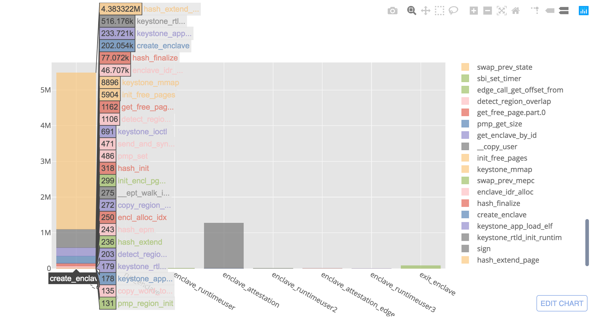

# Benchmarks for Keystone Enclave

Includes benchmarks for SHA256, AVL Tree, Base64 encoding, matrix mulitplication and finding the max element in an array.

For the newer benchmarks (not working at the moment due to limitations of
Keystone) - Clone into the SDK directory. Run `make` and copy binaries into the bin folder.

In addition to benchmarks, we have analysis (see the Jupyter Notebook) on multiple runs of Keystone with an
error bound on each benchmark. Using the plotly API, profiling the charts is
possible.

## Setup

### Run Benchmarks

Set up your firesim manager for running Keystone with the instructions [here](https://github.com/keystone-enclave/keystone/blob/f6cebdad7a4cbc0d057a0aa177617a6afe49c9c5/docs/source/Getting-Started/Running-Keystone-with-FireSim.rst) if you haven't yet.

Replace the `tracerv_cc.c` file with the one in this repo, located in
`firesim/sim/src/main/cc/endpoints`.

Currently, our trace parsing scripts lie in [here](https://github.com/keystone-enclave/keystone-firesim/tree/cs294-keystone), so you'll want to checkout your firesim repo by doing:
```bash
git remote add upstream git@github.com:keystone-enclave/keystone-firesim.git
```

Or for HTTPs users:
```bash
git remote add upstream https://github.com/keystone-enclave/keystone-firesim.git
```

```bash
git fetch
git checkout cs294-keystone
```

For now, you must run your programs in Firesim one-by-one.
After running one program, you'll need to transfer the `TRACEFILE` and extract the
symbols from it for usage in the Jupyter Notebook.

```bash
scp <firesim-f1-instance>:~/sim_slot_0/TRACEFILE ~/firesim/trace
cd ~/firesim/trace
./list_symbols.sh
./parse_symbols.sh
python filterSymbols.py symbols.txt symbol.list symbols.filtered.txt
python ./analyze.py TRACEFILE symbols.filtered.txt output.txt
```

Note that there might be an `IndexError` after running the `analyze.py` script, which should be
fine.

Now you can run through the Jupyter Notebook and get fancy charts.



### Install python dependencies on Firesim manager (or locally)
```bash
pip install pandas matplotlib jupyter
pip install plotly cufflinks --user
```

### Launch juypter server on Firesim manager
```bash
jupyter notebook --no-browser --port=8080
```

### SSH tunnel into jupyter server
```bash
ssh -i firesim.pem -N -L 8080:localhost:8080 <manager host>@<manager ip>
```

## Commands
```
make
```

```
make clean
```
